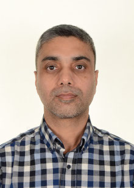

## Welcome to Upshore Immigration Services
---
### Our work
Upshore Immigration Services is an approved Canadian Immigration Consultant company. We provide services to those who wish to immigrate, work, study or visit Canada. We welcome clients from all across the spectrum, including but not limited to:

* Individuals seeking to immigrate to Canada as Skilled workers
* Individuals seeking to immigrate with previous Canadian work experience
* Families seeking to join together through sponsorship
* Skilled workers and trades-persons who wish to work in Canada.
* Students who wish to study in Canadian educational institutions
* Citizens and PRs wishing to sponsor their spouses, children, parents and grandparents
* People who wish to come to Canada as tourists
* Individuals whose cases have been rejected earlier and wish to apply again
* Permanent residents who wish to file Citizenship applications

### Our Values
Our company's guiding philosophy is based on its core values. These values are:

* Honesty and integrity - A business should be firmly based upon values of honesty and integrity. Its should establish relationship with its client based on these values. Such relationships not only succeed, they contribute to a better world and are best referrals for a business.
* Legal advising - When dealing with law, always work within the law.
* Professionalism - Upshore believes in not only living to its own standards but to always seek to raise those standards. This should be reflected in all aspects of communicating, advising, explaining, offering, preparing, executing and delivering services to our clients.
* Transparency - Upshore does not keep its clients in the dark. All the options, possible outcomes, stages and results are clearly conveyed to the clients

### The Director

I am Shavinder Dandiwal, a **Regulated Canadian Immigration Consultant (RCIC)** registered with the _Immigration Consultants of Canada Regulatory Council (ICCRC)_. My registration number is R535617 which can be checked on this ICCRC website: [link](https://iccrc-crcic.ca/find-a-professional/) (note: this is an external link, use back button to come back). I hold degrees in Education. I have several years of experience in various fields including teaching and education. I have a life long interest in developing a deeper understanding of life with its numerous facets. I like to help others in their efforts and take joy in their success.
